# Настройка рабочего окружения

Windows

### Установка VS Code

1. Заходим на оф.сайт https://code.visualstudio.com/ и нажимаем кнопку Download for Windows

    

2.  Запускаем инсталятор и выбираем путь и параметры, дожидаемся конца установки

    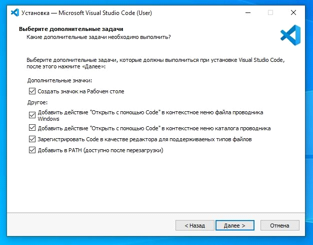

3. Запускаем VS Code (VS Code предложит установить языковой пакет, соглашаемся если нужно, перезапустится)

### Установка Node.js

1. Идем на официальный сайт https://nodejs.org/en/ и качаем LTS версию
2. Запускаем инсталятор
3. Устанавливаем не меняя параметры кроме пути установки
4. Перезапускаем VS Code, открываем терминал и проверяем версию командой node -v

    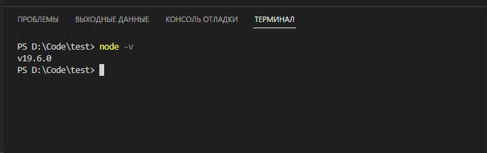

Должно получиться так, только с номером вашей LTS версии.

### Установка git bash

1. Идем на оф.сайт https://git-scm.com/download/win и качаем Standalone Installer нужной разрядности
2. Запускаем инсталятор и следуем инструкциям на скриншотах

    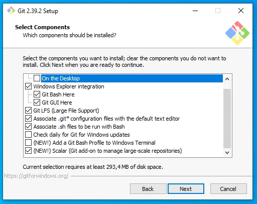
    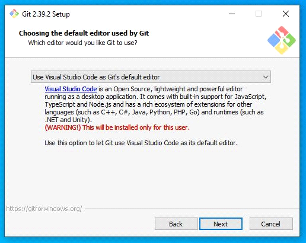
    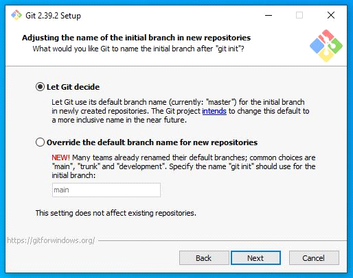
    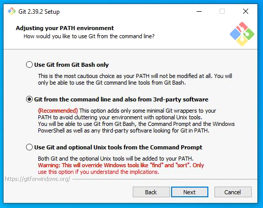
    
    
    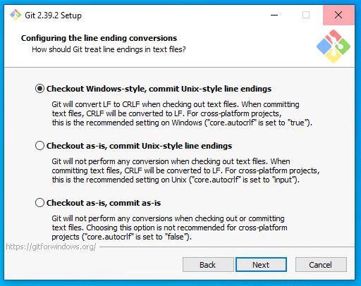
    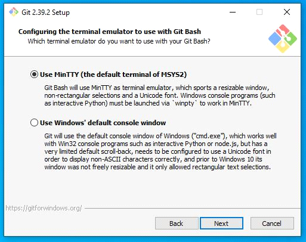
    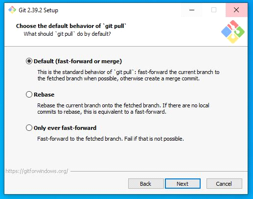
    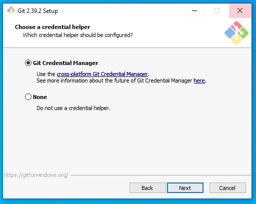
    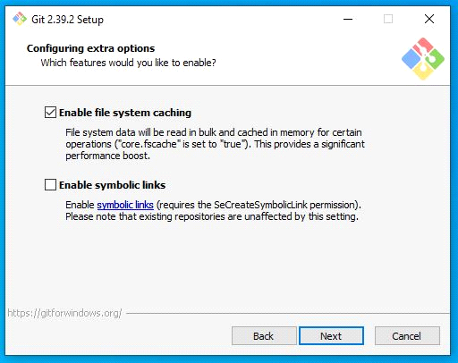

### Настройка Git bash

1. В любой папке, нажатием правой кнопки мыши, вызываем контекстное меню и 
выбираем пункт `Git Bash Here`
2. В открывшемся терминале необходимо ввести две команды
`$ git config --global user.name "Ваш никнейм на github"`
`$ git config --global user.email ВашEmailНаGithub@example.com`
3. Проверяем коммандой `git config --list`

### Генерация ключа  SSH

1. Открываем командную строку Windows
2. Вводим команду `ssh-keygen`
3. Приложение запросит место сохранения, предлагая по умолчанию, нажимаем Enter
`C:\users\имя_пользователя\.ssh\id_rsa`
4. Далее вам будет предложено ввести кодовую фразу. Нажмите клавишу Enter, чтобы пропустить
5. Подтверждение кодовой фразы так-же пропускаем
6. После генерации идем по пути `C:\users\имя_пользователя\.ssh\` и открываем файл `id_rsa.pub` любым текстовым редактором и копируем содержимое.
7. Идем в настройки аккаунта на GitHub

    

8. Нажимаем кнопку New SSH Key и в открывшемся окне вставляем содержимое из файла `id_rsa.pub` и вводим название ключа

    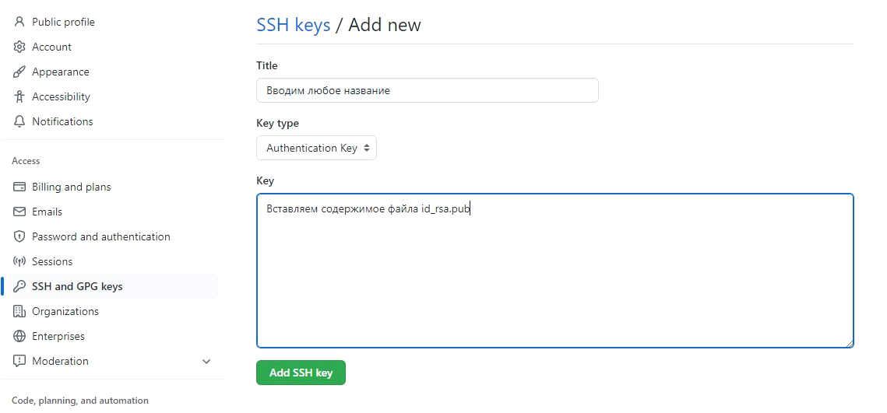

### Итог
На этом установка необходимого ПО завершена.
Необходимо переходить к инструкциям по настройке VS Code и использование GitHub

Ubuntu

### Установка VS Code

Через пакет

 

- Переходим на сайт code.visualstudio.com, секция Download. Нажимаем и скачиваем себе на ПК.
- Устанавливаем

Через терминал

1. Заходим на оф.сайт https://code.visualstudio.com/docs/setup/setup-overview и выбираем Linux. По инструкции вводим следующие команды в терминал для Убунту

`sudo apt-get install wget gpg`\
`wget -qO- https://packages.microsoft.com/keys/microsoft.asc | gpg --dearmor > packages.microsoft.gpg`\
`sudo install -D -o root -g root -m 644 packages.microsoft.gpg /etc/apt/keyrings/packages.microsoft.gpg`\
`sudo sh -c 'echo "deb [arch=amd64,arm64,armhf signed-by=/etc/apt/keyrings/packages.microsoft.gpg] https://packages.microsoft.com/repos/code stable main" > /etc/apt/sources.list.d/vscode.list'`\
`rm -f packages.microsoft.gpg`\
`sudo apt install apt-transport-https`\
`sudo apt update`\
`sudo apt install code`

### Установка Node.js

- Ввести в терминал `sudo apt update`
- `sudo apt install nodejs`
-  Проверить можно командой `node -v`или `nodejs -v`. Должен показаться номер вашей версии Node.js

### Установка Git

- Ввести в терминал
`sudo apt update`\
Возможно, вас попросят ввести пароль. Введите пароль. <strong>Внимание:</strong> его не будет видно в терминале, это нормально.

`sudo apt upgrade`\
`sudo apt install git`

- Можно проверить, что у вас установился `git`, введя в терминале `git`. Должен открыться список команд.

### Настройка Git

1. В терминале необходимо ввести две команды
`git config --global user.name "Ваш никнейм на github"`
`git config --global user.email ВашEmailНаGithub@example.com`
2. Проверяем коммандой `git config --list`

### Генерация ключа  SSH

1. Открываем терминал
2. Вводим команду `ssh-keygen -t ed25519 -C "ваш_email@example.com"`
3. Приложение запросит место сохранения, предлагая по умолчанию, нажимаем `Enter`
4. Далее вам будет предложено ввести кодовую фразу. Нажмите клавишу `Enter`, чтобы пропустить
5. Подтверждение кодовой фразы также пропускаем
6. После генерации идем по пути из 3го пункта и открываем файл `id_ed25519.pub` любым текстовым редактором и копируем содержимое.
7. Идем в настройки аккаунта на GitHub

    

8. Нажимаем кнопку New SSH Key и в открывшемся окне вставляем содержимое из файла `id_ed25519.pub` и вводим название ключа

    

### Итог

На этом установка необходимого ПО завершена.
Необходимо переходить к инструкциям по настройке VS Code и использование GitHub

MacOS

### Установка VS Code

1. Заходим на оф.сайт https://code.visualstudio.com/docs/setup/setup-overview и выбираем macOS. По инструкции открываем первую ссылку и скачиваем пакет в виде архива.
2. Нам необходимо распаковать архив и перетащить `Visual Studio Code.app` в папку `Applications`.
3. Добавим Visual Studio Code в `Dock`, выбрав в `Options` `«Keep in Dock»`

### Установка Git

- Если у вас нет пакетного менеджера Brew, необходимо сначала установить его. Переходит на оф. сайт и https://brew.sh/ и копируем команду оттуда
`/bin/bash -c "$(curl -fsSL https://raw.githubusercontent.com/Homebrew/install/HEAD/install.sh)"`
- Затем вводим в терминал `brew install git`
- Можно проверить, что у вас установился `git`, введя в терминале `git`. Должен открыться список команд.

### Установка Node.js

- Ввести в терминал `brew update`
- `brew install node`
-  Проверить можно командой `node -v. Должен показаться номер вашей версии Node.js

### Настройка Git

1. В терминале необходимо ввести две команды
`git config --global user.name "Ваш никнейм на github"`
`git config --global user.email ВашEmailНаGithub@example.com`
2. Проверяем коммандой `git config --list`

### Генерация ключа  SSH

1. Открываем терминал
2. Вводим команду `ssh-keygen -t ed25519 -C "ваш_email@example.com"`
3. Приложение запросит место сохранения, предлагая по умолчанию, нажимаем `Enter`
4. Далее вам будет предложено ввести кодовую фразу. Нажмите клавишу `Enter`, чтобы пропустить
5. Подтверждение кодовой фразы также пропускаем
6. После генерации идем по пути из 3го пункта и открываем файл `id_ed25519.pub` любым текстовым редактором и копируем содержимое.
7. Идем в настройки аккаунта на GitHub

    

8. Нажимаем кнопку New SSH Key и в открывшемся окне вставляем содержимое из файла `id_ed25519.pub` и вводим название ключа

    

### Итог

На этом установка необходимого ПО завершена.
Необходимо переходить к инструкциям по настройке VS Code и использование GitHub

# Оптимизация работы в VSCode

Автосохранение

Настройте в VSCode автоматическое сохранение файла при редактировании.

    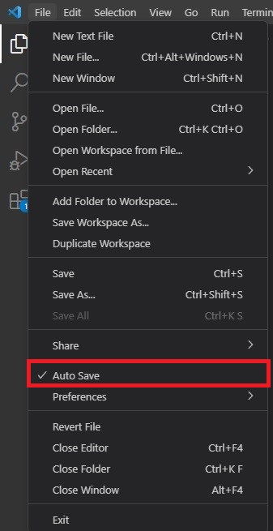

Расширения

### Live Server
> Расширение позволяет автоматически перезагружать страницу после внесения изменений в js, css, html-код. Это упрощает отладку отдельных HTML-страниц со скриптами.

После установки в правом нижнем углу появится кнопка `Go Live`. Достаточно открыть в VSCode html документ, нажать на кнопку `Go Live` и спустя несколько секунд html автоматически откроется в вашем браузере по умолчанию.

### Code Runner
> Расширение позволяет запускать js код внутри VSCode.

После установки в правом верхнем углу появится кнопка в виде треугольника (см. скрин). Внимание: DOM не будет запускаться внутри VSCode, он работает только в браузере.

    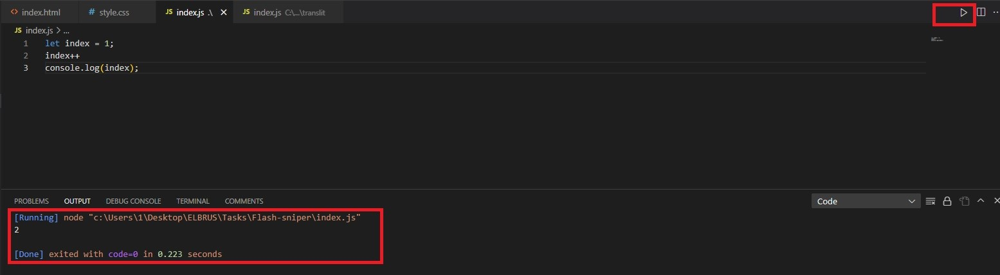

### Prettier
> Пакет для автоматического форматирования кода, который поддерживает JavaScript, TypeScript, CSS и множество других языков программирования.

После установки вам потребуется настроить конфигурацию. Для этого 
- используйте сочетание клавиш `Ctrl + P` или `Command + Shift + P`
- в появившемся окне введите `>format` и выберите `Format Document`
- в первый раз вам будет предложено выбрать приложения для форматирования. Выберите `Prettier`
- в следующий раз можете запускать форматирование по сочатанию клавиш, которое написано рядом с `Format Document`

    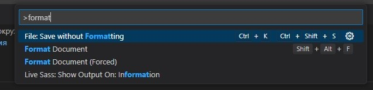

# F.A.Q.
### Обязательно устанавливать убунту?

Можно работать и на windows, но мы советуем убунту, потому что начиная с 1 фазы преподаватель использут MACOS или UBUNTU
### Я никогда не пользовался slack, почему он?

Процесс обучения в Elbrus Bootcamp максимально приближен к реальной разработке, мы используем те же инструменты, что и большинсвто IT-компаний. Slack - популярный корпоративный мессенджер с более широким функционалом, удобной структурой и поиском, поэтому основная коммуникация происходит через него. На первом звонке куратор подробнее расскажет об этом инструменте.
                                         
### Можно ли выполнять задания наперёд?

Да, но проверены они будут в рамках общего дедлайна. Так же можно обратиться к ментору за спискоим дополнительных тем и задач для выполнения, важно каждый день прокачивать себя и делать что-то новое. 

### Что делать, если не смог выполнить какое-то задание вовремя?

Если тебе не хватило пары часов - важно все равно доделать и отправить работу, она так же будет проверена, но без подробного фидбека. Если пропущен день или несколько - к ним будет возможность вернуться в выходные, а сейчас лучше приступить к выполнению заданий текущего дня.

### Какие программы мне будут нужны?
                                         
VSCode, Node.js, Git, Slack, Git bash (для Windows)
                                         
### К кому я могу обращаться за помощью?
                                         
В slack есть каналы для вопросов по заданиям каждого дня, они обозначаютя #project-w1d1, где w - номер недели (1,2,3), а d - номер дня, в них можно задать свой вопрос, предварительно проверив, не задавлся ли он ранее.
                                         
### Как понять, что мое задание проверили?
                                         
Уведомления приходят в гитхаб (колокольчик в правом верхнем углу) и на почту, привязанную к аккаунту. 
                                         
### Почему у Фазы 0 такой формат?
                                         
Фаза 0 - единственный фаза, где есть предзаписанные лекции и общение с менторами минимально. Таким форматом мы культивируем навыки самостоятельной работы, которые пригодятся в дальнейших фазах и на работе. Также студенты учатся формулировать свои проблемы и правильно задавать вопросы, чтобы получить помощь. 
                                         
### Я заболел/мне необходимо отлучиться по личным причинам?
                                         
Об этом необходимо будет предупредить куратора через личные сообщения в slack, она поможет выстроить план дальнейших действий.
                                         
### Где мне искать задания?
                                         
Все задания размешены в GitHub по ссылке (https://github.com/Elbrus-Bootcamp/phase-0) и распределены по неделям. 
                                         
### Валидатор выдает ошибки, могу ли я отправить задание?
                                         
Ошибки необходимо исправлять, проверять через валидатор заново, затем уже отправлять.
                                         
### Не могу присутствовать на звонке
                                         
У всех звонков (кроме звонка-знакомства) есть запись, с которой можно ознакомиться в любое удобное время, но на звонке есть возможность задавать вопросы и получить более развернутый ответ от ментора.
                                         
### Как получить налоговый вычет?
                                         
[По ссылке здесь](https://archive.sendpul.se/v/45uoj/9zt4a/)
