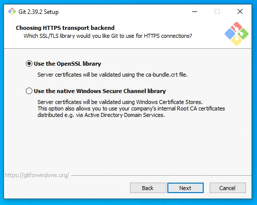

# Настройка рабочего окружения

Windows

### Установка VS Code

1. Заходим на оф.сайт https://code.visualstudio.com/ и нажимаем кнопку Download for Windows

    

2.  Запускаем инсталятор и выбираем путь и параметры, дожидаемся конца установки

    

3. Запускаем VS Code (VS Code предложит установить языковой пакет, соглашаемся если нужно, перезапустится)

### Установка Node.js

1. Идем на официальный сайт https://nodejs.org/en/ и качаем LTS версию
2. Запускаем инсталятор
3. Устанавливаем не меняя параметры кроме пути установки
4. Перезапускаем VS Code, открываем терминал и проверяем версию командой node -v

    

Должно получиться так, только с номером вашей LTS версии.

### Установка git bash

1. Идем на оф.сайт https://git-scm.com/download/win и качаем Standalone Installer нужной разрядности
2. Запускаем инсталятор и следуем инструкциям на скриншотах

    
    
    
    
    
    
    
    
    
    
    

### Настройка Git bash

1. В любой папке, нажатием правой кнопки мыши, вызываем контекстное меню и 
выбираем пункт `Git Bash Here`
2. В открывшемся терминале необходимо ввести две команды
`$ git config --global user.name "Ваш никнейм на github"`
`$ git config --global user.email ВашEmailНаGithub@example.com`
3. Проверяем коммандой `git config --list`

### Генерация ключа  SSH

1. Открываем командную строку Windows
2. Вводим команду `ssh-keygen`
3. Приложение запросит место сохранения, предлагая по умолчанию, нажимаем Enter
`C:\users\имя_пользователя\.ssh\id_rsa`
4. Далее вам будет предложено ввести кодовую фразу. Нажмите клавишу Enter, чтобы пропустить
5. Подтверждение кодовой фразы так-же пропускаем
6. После генерации идем по пути `C:\users\имя_пользователя\.ssh\` и открываем файл `id_rsa.pub` любым текстовым редактором и копируем содержимое.
7. Идем в настройки аккаунта на GitHub

    

8. Нажимаем кнопку New SSH Key и в открывшемся окне вставляем содержимое из файла `id_rsa.pub` и вводим название ключа

    

### Итог
На этом установка необходимого ПО завершена.
Необходимо переходить к инструкциям по настройке VS Code и использование GitHub

